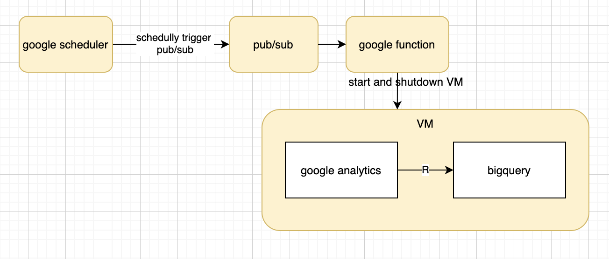

# Schedully export data from Google analytics into Bigquery

## Structure:

## Steps:
1. Got to [API Credentials](https://console.cloud.google.com/apis/credentials) to create `cient_secrets.json` for google analytics and service_account.json for bigquery connection. Download jsons.
2. Run `Rscript app_vm.R`
3. Run `run.sh`

### Reference:
- [scheduling compute instances with cloud scheduler](https://cloud.google.com/scheduler/docs/start-and-stop-compute-engine-instances-on-a-schedule#gcloud_3)
